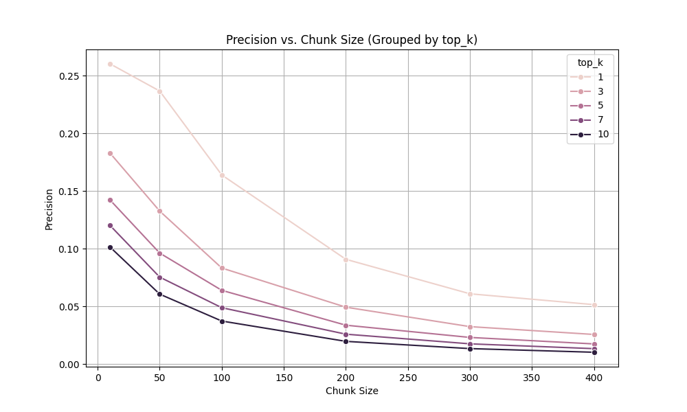
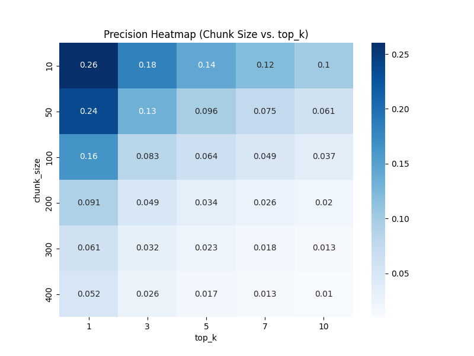
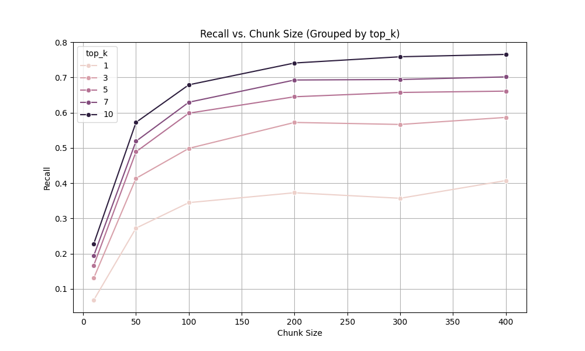
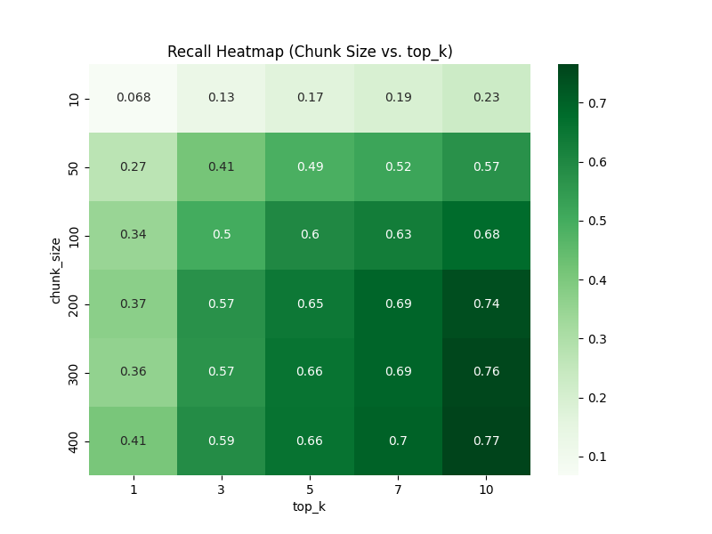

# Retrieval Evaluation for Code Documentation RAG

*Evaluating Chunking and Retrieval Hyperparameters on the Wikitext Dataset*

## 1. Introduction

This project evaluates a **Retrieval-Augmented Generation (RAG)** system by analyzing how various **chunking strategies** and **retrieval depths** influence retrieval quality. The main objective is to ensure that the retriever can return chunks of a corpus that align closely with the golden ground truth excerpts, while balancing **precision (efficiency)** and **recall (coverage)**.

## 2. Dataset and Setup

- **Corpus used**: `wikitexts.md`
- **Queries**: Extracted from `questions_df.csv` with golden references.
- **Embedding model**: [`all-MiniLM-L6-v2`](https://huggingface.co/sentence-transformers/all-MiniLM-L6-v2)
- **Chunking method**: Token-based chunker with overlap using `tiktoken` (FixedTokenChunker).

## 3. Project Overview

The system is structured into several key modules, each responsible for a specific component of the retrieval pipeline. The `data/` directory contains the input datasets, including corpora and annotated questions. The `results/` directory stores the outputs generated by the pipeline, such as evaluation metrics and visualizations.

| Module               | Class / Function              | Responsibility                                                                 |
|----------------------|-----------------------------|---------------------------------------------------------------------------------|
| `dataset_loader.py`  | DatasetLoader             | Loads the corpus text and questions with golden excerpts            |
| `chunking.py`        | FixedTokenChunker         | Splits text into overlapping token-based chunks using the `tiktoken` tokenizer |
| `embedding.py`       | EmbeddingModel            | Embeds chunks and queries using a pre-trained `SentenceTransformer`                          |
| `retrieval.py`       | RetrievalPipeline         | Retrieves top-k most relevant chunks based on cosine similarity                |
| `evaluation.py`      | RetrievalEvaluator        | Evaluates retrieval quality (precision, recall) using token index overlap |
| `run_pipeline.py`   | `run_pipeline()` + argparse | Orchestrates the full retrieval pipeline: loads data, chunks corpus, generates embeddings, retrieves top-k chunks, evaluates with precision and recall, and saves results to CSV |
| `visualization.py`   |    | Automates experiments across different parameters and visualizes the results |

## 4. Chunking Strategy: FixedTokenChunker

The `FixedTokenChunker` is implemented using OpenAI’s `tiktoken` library and splits the corpus into fixed-size overlapping chunks of tokens. The overlap is configurable as a percentage of chunk size. This method was adapted from the official benchmark [implementation](https://github.com/brandonstarxel/chunking_evaluation/blob/main/chunking_evaluation/chunking/fixed_token_chunker.py) published by Chroma Research. The methodology was proposed in the paper [Evaluating Chunking Strategies for Retrieval](https://research.trychroma.com/evaluating-chunking). 

In our implementation, the `FixedTokenChunker` class is defined in the `chunking.py` file.

## 5. Evaluation Metrics

The implementation of the evaluation logic  was based on the methodology described in the Chroma Research [paper](https://research.trychroma.com/evaluating-chunking).
The paper proposes token-level metrics, including Precision, Recall, and IoU. In this work, we focused on implementing **Precision** and **Recall** metrics. 

The logic for this computation is implemented in the `RetrievalEvaluator` class, located in the `evaluation.py` file. The class is initialized with the evaluation queries with golden references and the original corpus text. For each query, the `evaluate()` method takes three inputs — the query string, the list of retrieved chunks, and the corresponding `corpus_id` — and returns token-level precision and recall scores.

## 6. Experiment Configuration

We test different values of chunk size and `top_k` retrieved chunks:

- Chunk size: `[10, 50, 100, 200, 300, 400]`
- Number of retrieved chunks:: `[1, 5, 7, 10]`

Chunk overlap: 20% `(chunk_overlap = chunk_size // 5)`

 Each configuration was executed using the modular pipeline defined in `run_pipeline.py`, and batch evaluations were managed through `visualization.py`.

## 7. Retrieval Pipeline Overview

The retrieval process is orchestrated through `run_pipeline.py`, which executes the full pipeline for a given configuration. The pipeline follows this sequence:

1. **Data Loading**: The input corpus and questions are loaded using `DatasetLoader` (from `dataset_loader.py`), filtering only the relevant queries.
2. **Chunking**: The corpus is split into chunks using `FixedTokenChunker`.
3. **Embedding**: Both chunks and queries are embedded using a SentenceTransformer model through the `EmbeddingModel` class.
4. **Retrieval**: The `RetrievalPipeline` retrieves the top-k most similar chunks for each query based on cosine similarity.
5. **Evaluation**: The `RetrievalEvaluator` compares retrieved chunks to golden references and computes token-level precision and recall.
6. **Result Saving**: Evaluation metrics are saved into CSV files.

All parameters such as chunk size and number of retrieved chunks are configurable through command-line arguments.

## 8. Visual Analysis

To analyze the impact of different chunk sizes and retrieval depths (`top_k`) on retrieval quality, we automated a grid of experiments using the `visualization.py` script. 

The following graphs provide visual insights into how chunk size and retrieval depth influence precision and recall.

### Precision vs Chunk Size
This graph reveals that **precision decreases** as **chunk size increases**, across all `top_k` values. This is expected because smaller chunks are more focused and less likely to contain irrelevant tokens. In contrast, larger chunks may include more noise, which reduces the precision. 

A chunk size of 10 consistently outperforms chunk sizes of 300 or 400. One explanation for this is that the average query length in evaluation dataset is relatively short, often around 10–20 tokens. Smaller chunks are therefore better aligned with the query, increasing the chance of a clean match with minimal noise.

Furthermore, **increasing top_k tends to lower precision**. When more chunks are retrieved per query, the likelihood of including irrelevant ones increases

### Precision Heatmap

The precision heatmap reinforces the trends observed in the line plot. Precision is highest in the top-left corner, where both `chunk_size` and `top_k` are small.

---
### Recall vs Chunk Size

The recall plot demonstrates an opposite trend: as **chunk sizes increase, recall also increases**. Larger chunks are more likely to contain relevant excerpts.

Similarly, **increasing top_k also improves recall**, since retrieving more chunks increases the chances that at least one of them overlaps with the golden reference. 

However, higher recall often comes at the cost of lower precision, which emphasizes the **trade-off between precision and recall**

### Recall Heatmap

The recall heatmap complements the previous findings. The highest recall of **0.77** occurs when using a `chunk_size` of 400 and retrieving 10 chunks. 

These graphs clearly demonstrate the **trade-off** between precision and recall:
- Small chunks + low top_k → High precision, low recall
- Large chunks + high top_k → High recall, low precision

## 9. Key Observations and Conclusion

Our experiments across various configurations of chunk size and `top_k` led to the following insights:

1. **Smaller chunks improve precision**: A chunk size of 10 consistently outperformed larger sizes (e.g., 300–400). This is likely due to better alignment between the small, focused chunks and the relatively short queries (typically 10–20 tokens).

2. **Larger chunks improve recall**: Bigger chunks are more likely to contain relevant content; however, they often introduce irrelevant tokens, which can reduce precision.

3. **Increasing `top_k` boosts recall but lowers precision:** Retrieving more chunks increases the chances of including relevant spans but also brings in more irrelevant ones.

4. **Trade-off between precision and recall** Optimizing for one metric leads to a reduction in the other. Smaller chunks and lower `top_k` favor **precision**, while larger chunks and higher `top_k` favor **recall**.

5. **Computational efficiency**: Larger chunks reduce the number of embeddings and similarity calculations, making them more efficient for large-scale systems.

While smaller chunks improve retrieval alignment, they may fragment semantically coherent units, especially in code or structured documentation. On the other hand, larger chunks are more efficient but may mix unrelated information or exceed the model’s context capacity.

In conclusion, there is no one-size-fits-all chunking configuration. A thoughtful balance must be struck between chunk size, overlap, and retrieval depth based on the task, document type, and other relevant factors.